# The book shelf

## Purpose/Target Audience

 The book_shelf website is primary to provide an online book sharing and recommendation community for those who enjoy sharing their reading experiences and recommendations with others. It provides easy access to book summaries, reviews, and ratings, helping users discover new books. Based on the user's reading history, preferences, and interests, they can connect with like-minded readers.

[Link to the live site](https://book-shelf-e3665f129252.herokuapp.com/)

## Index – Table of Contents
* [User Experience (UX)](#user-experience-ux) 
* [Agile](#agile)
* [Features](#features)
* [Technologies Used](#technologies-used)
* [Testing](#testing)
* [Deployment](#deployment)
* [Credits](#credits)

## Database plan
## Data structure in Lucichart

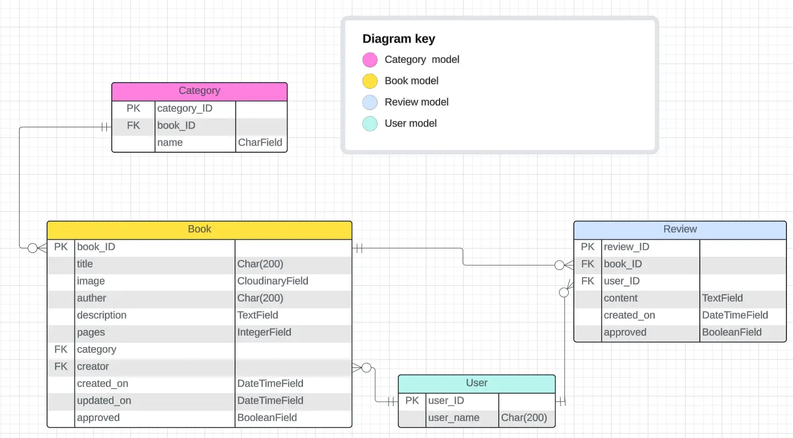

- After project purpose decided, [lucichart](https://lucid.app/documents#/) is utilized to plan the database structure.
- The above diagram is serving as an guide to indicate the field types and relationships between data stored in database.

## Data models

- User model
  - 
    - Django pre-defined model
  
  |    | Field name    | Field type |
  |----|---------------|------------|
  | PK | user_ID       |            |
  |    | user_name     | CharField  |
  |    | user_password | CharField  |

- Book model
  - 
  |    | Field name   | Field type      |
  |----|--------------|-----------------|
  | PK | book_ID      |                 |
  |    | title        | Char(200)       |
  |    | image        | CloudinaryField |
  |    | auther       | Char(200)       |
  |    | descriptioin | TextField       |
  |    | pages        | IntegerField    |
  | FK | category     |                 |
  | FK | user         |                 |
  |    | created_on   | DateTimeField   |
  |    | updated_on   | DateTimeField   |
  |    | approved     | BooleanField    |

- Review model
  - 
  |    | Field name | Field type    |
  |----|------------|---------------|
  | PK | review_ID  |               |
  | FK | book_ID    |               |
  | FK | user_ID    |               |
  |    | content    | TextFiled     |
  |    | created_on | DateTimeField |
  |    | approved   | BooleanField  |

- Category model
  - 
  |    | Field name  | Field type |
  |----|-------------|------------|
  | PK | category_ID |            |
  | FK | book_ID     |            |
  |    | name        | CharField  |

  

[Back to Top](#top)

# user-experience-ux

## Overview

The UX design focuses on creating an engaging and welcoming environment. After signup and logging in, the site user would be able to add a new book they would like to share with other users and add a review to any books,sharing thoughts. They can search book by book name key words, book author key words or book 4 categories(Fiction,Non_fiction,Science_fiction and Children'S&Teenage).

## Site User
The primary users of book_shelf are anyone who would like to share or recommend books based on their reading experiences and preferences. It aims to provide a supportive and inclusive community where the site users can share their feelings about books and recommend books to other like-minded readers. They value authenticity, empathy, and the opportunity to engage with like-minded individuals in a safe and welcoming space.

## Purposes for the site
 The site commits for an environment where users feel encouraged to share or recommend their books.To provide inspirations for someone who is seeking new books to read and build meaningful connections with other readers.

## Wireframes created in Balsamic
- Home Page for mobile screen
   - 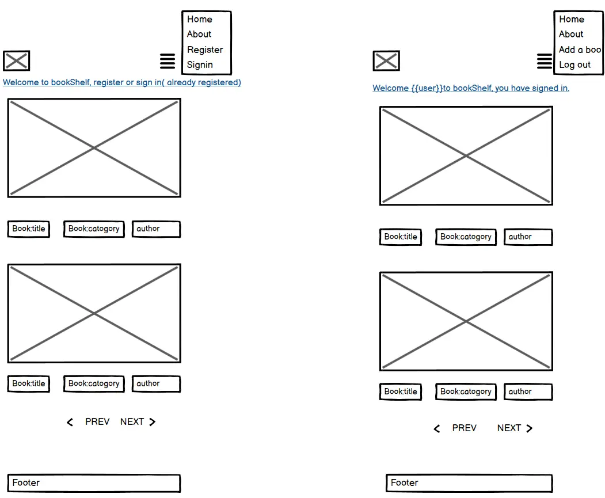

- Home Page for pad/laptop screen
   - 

- About Page
   - 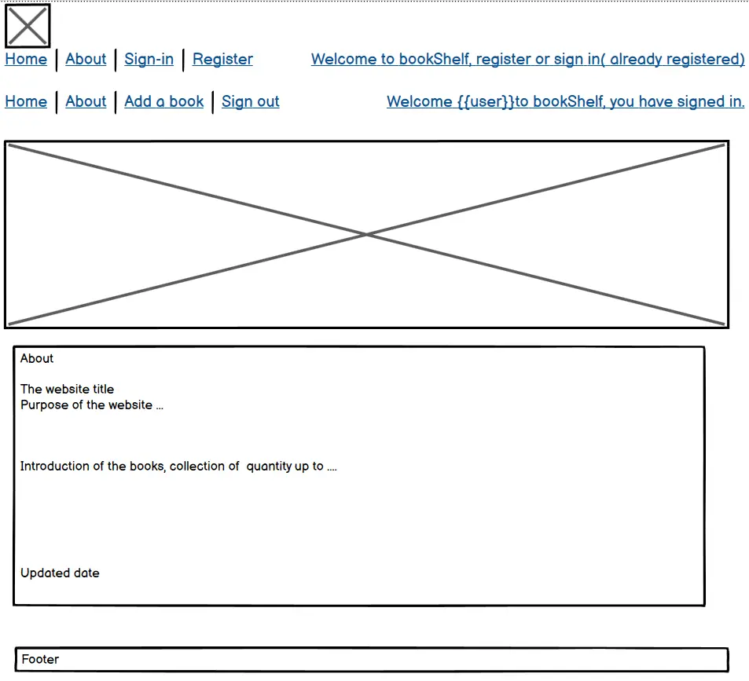

- Book detail page for logged in user
   - 

- Add a book page for logged in user
   - 

### Colour schemes
The colour schemes generated from [cooler](https://coolors.co/c9daea-03f7eb-00b295-191516-ab2346) as below:

### Font
[Googlefont](https://fonts.google.com/) of Lato used.

[Back to Top](#top)

# agile

## Agile development

In the app of book_shelf development life-cycle, Agile methodology was used to ensure iterative and efficient progress throughout the project development. Central to this approach was the utilization of a Kanban board hosted on GitHub Projects. You can view the project board as: [KANBAN Board](https://github.com/users/Grace-YuGuo/projects/6).

 -

### Kanban overview
The Kanban board served as a visual representation of the project's progress and allowed for effective task management,enhanced visibility,increased efficiency,to assess and improve the flow of work. It consisted of the following sections:

- Todo: This section contained all the tasks and user stories that were yet to be prioritized for implementation.
- In Progress: Work in progress was tracked here, indicating tasks actively being worked on.
- Done: Tasks that were completed successfully were moved to this column.
- Future features: Tasks to be implemented in the future.

### User Stories Integration
User stories played a pivotal role in shaping the development process, ensuring that features were aligned with user needs.User storires integration into Kanban board is an effective way to manage and prioritize tasks while ensuring that project progress remains aligned with the goals and needs of users.  These user stories were mapped onto the Kanban board, guiding the prioritization and implementation of tasks, enhanced focusing on usr needs, better visibility and tracking, and increased flexibility.

### Task Management
In addition to tracking user stories, the Kanban board served as a comprehensive task list. User stories were breaking into smaller, actionable units of tasks, ensuring clear and manageable objectives for development. This specific approach facilitated efficient progress tracking.By leveraging Agile principles and utilizing the Kanban board effectively, the development of book_shelf remained focused, adaptable, and responsive to evolving requirements, resulting in a more robust and user-centric Django application.

## User Stories Overview
### List of User Stories

- [#1 View paginated lists of books ](https://github.com/Grace-YuGuo/book-shelf-full-stack/issues/1)
- [#2 Open a book ](https://github.com/Grace-YuGuo/book-shelf-full-stack/issues/2)
- [#3 View book reviews ](https://github.com/Grace-YuGuo/book-shelf-full-stack/issues/3)
- [#4 Review on a book ](https://github.com/Grace-YuGuo/book-shelf-full-stack/issues/4)
- [#5 Modify or delete a review on a book ](https://github.com/Grace-YuGuo/book-shelf-full-stack/issues/5)
- [#6 Add a book ](https://github.com/Grace-YuGuo/book-shelf-full-stack/issues/6)
- [#7 Modify or delete book ](https://github.com/Grace-YuGuo/book-shelf-full-stack/issues/7)
- [#8 Account registration](https://github.com/Grace-YuGuo/book-shelf-full-stack/issues/8)
- [#9 Manage books ](https://github.com/Grace-YuGuo/book-shelf-full-stack/issues/9)
- [#10 Approve book reviews](https://github.com/Grace-YuGuo/book-shelf-full-stack/issues/10)
- [#11 About ](https://github.com/Grace-YuGuo/book-shelf-full-stack/issues/11)
- [#12 Templates styling ](https://github.com/Grace-YuGuo/book-shelf-full-stack/issues/12)
- [#13 Log in via social media accounts ](https://github.com/Grace-YuGuo/book-shelf-full-stack/issues/13)
- [#14 Search the book by title author and category ](https://github.com/Grace-YuGuo/book-shelf-full-stack/issues/14)
- [#15 Manual and automatic testing ](https://github.com/Grace-YuGuo/book-shelf-full-stack/issues/16)
- [#16 Profile ](https://github.com/Grace-YuGuo/book-shelf-full-stack/issues/17)

### MOSCOW Details
- MO (Book CRUD | Review CRUD | Account registration | )
- S ( Approve book reviews | Approve book | About page | Search book)
- CO (View paginated books | Templates styling | )
- W (Log in via social media account | Profile page)

[Back to Top](#top)

# Features

## Features implemented

- Create/read/edit/delete a review to book:
   - The logged-in site user can read the reviews to a book
   - The logged-in site user can add reviews to a book and edit/delete the review they created

- Create/read/edit/delete a book: 
   - The guest user can read the list of books
   - The logged-in site user can read the list of books
   - The logged-in site user can add books and edit/delete the book they created

- Search a book via key words in book title or key words in book author or 4 categories(Fiction,Non_fiction,Science_fiction and Children's&Teenage)
- The site admin maintain the submitted books and reviews to books

  - 
  - 
  - 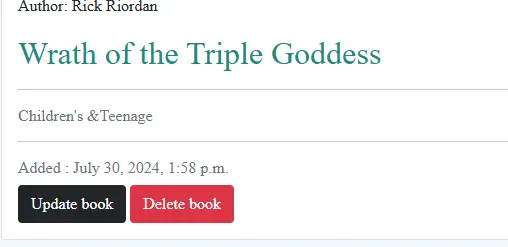
  - 
  - 

### Navbar and Footer:
- Unified navbar and footer on every page
- Navbar' content changes as signing in status,logged in user can see add a book navitem
- Footer includes social links and github link

### Home page:
- The homepage provides the list of books
- It can be accessed without signing in

### About Us page:
- About page includes a short brief instruction on the book_shelf site
- It can be accessed without signing in

### Responsiveness
- There's a hamburger navbar on mobile size screen

## Future features
- Log in via social account
    - At the home page, the site user can log in via social media account.
    - The user can select via facebook, twitter, or instgram account to log in the site and log in successfully with approriate incredientials.
- Profile page
    - Given a logged-in site user, view the summary list of books and reviews they submitted in a seperate site page.
    - Given a logged-in site user, view the status of the books and reviews user submitted.
    - Given a logged-in site user, they can check and update their name and password or profile information.

[Back to Top](#top)

# Testing 

## Validation
### HTML
[W3 HTML Validator](https://validator.w3.org/) to check the HTML pages.
- Errors on image&input' width attribute fixed.
- Errors on review edit&delete buttons' invalid attribute fixed.
- Errors on additional tags fixed.
- There are no more errors apart from third party package of summernotewidget related which are out of control.

### CSS
[W3 CSS Validator](https://jigsaw.w3.org/css-validator/) to check the CSS.
- No errors found.

### Python
[CI Python Linter](https://pep8ci.herokuapp.com/) to check python scripts
- Errors found on spaces fixed.
- Errors found on too long lines fixed.
- Errors found on other format issues(lines, indention)fixed.
- No more errors

## Manual test
### Home page
| TestCase Title | Preconditions | Pass/Fail |
|----------|----------|----------|
| List of books visibility | View as guest or logged-in user | Pass |
| Notification on the login status | View as guest or logged-in user | Pass |
| Update/Edit book button visibility only for the user who added the book| Logged-in user who has added own books | Pass |
| Update/Edit book button not visible for the guest or user who is not the owner of the book | View as guest or logged-in user but not the user who created the book record |Pass |
| Click the update button below the book, navigate to update book page| Logged-in user who has added the book | Pass |
| Click the delete button below the book, navigate to the delete book page | Logged-in user who has added the book| Pass |
| Click book title, navigate to specific book' detail page | View as guest or logged-in user | Pass |
| Click NEXT or PREV at the bottom of list of books, navigate to next or previous page | View as guest or logged-in user | Pass |

  - 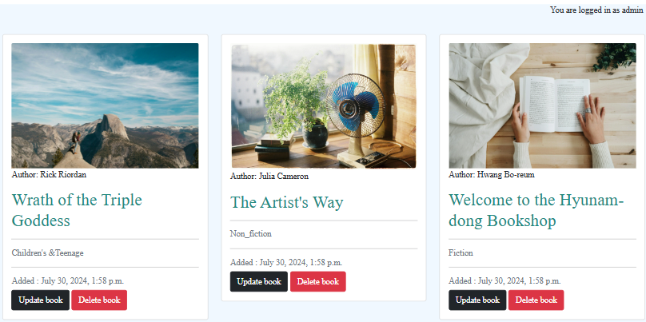
  - 

### About page
| TestCase Title | Preconditions | Pass/Fail |
|----------|----------|----------|
| At about page it shows the brief instruction of the site in proper layout | View as guest or logged-in user | Pass|

  - 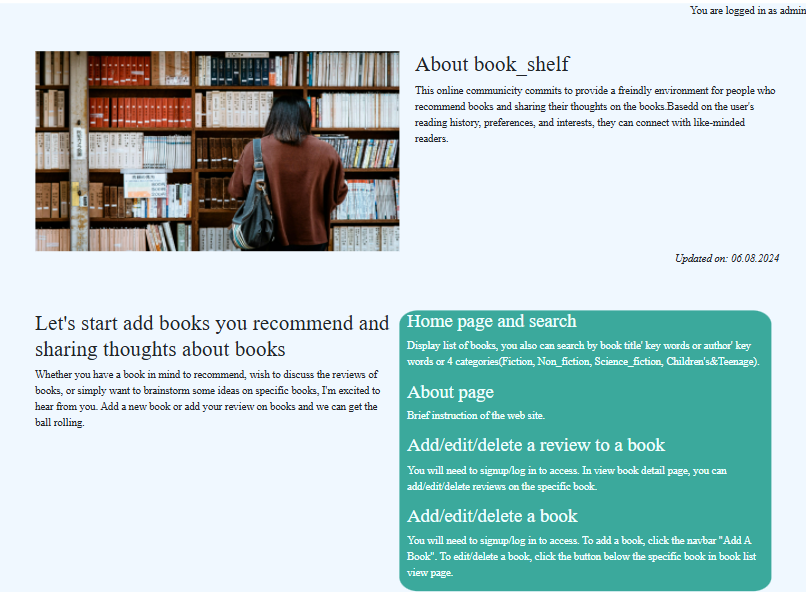

### Footer/NAVBar
| TestCase Title | Preconditions | Pass/Fail |
|----------|----------|----------|
| Navigation to 'home' page,'about' page,'register' page or 'login' page | View as guest | Pass |
| Navigation to 'home' page,'about' page,'add a book' page or 'logout' page | Logged-in user | Pass |
| Navigation to the social media page by click respective link on the footer,'facebook' 'twitter' 'github' 'linkedin'| View as guest or logged in user| Pass |
| Navigation to 'home' page after click the logo 'book_shelf' | View as guest or logged in user | Pass |
 
 - 
 - 
 - 

### Login/logout/registration page
| TestCase Title | Preconditions | Pass/Fail |
|----------|----------|----------|
| Register a new user on register page | Input valid username/email/password, click Signup button| Pass |
| Notification message to inform if registered succesfully  | Input valid username/email/password, click Signup button |Pass|
| Notification if invalid password| Input invalid password, click Signup button | Pass|
| Log in via valid username and password| Valid username and password to sign in, click Signin button| Pass|
| Notification message to inform if logged-in succesfully | Valid username and password to sign in, click Signin button | Pass |
| Loggin status changed to as logged-in as 'username' after signing in successfully | Valid username and password to sign in, click Signin button| Pass |
| On log out page, ask confirmation for double checking| Logged in user, click Log Out in navbar| Pass |
| Sign out as logged in user | Logged in user, click Sign Out on logout page | Pass |
| Notification message to inform if logged-out succesfully | Logged in user, click Sign Out on logout page| Pass |
| Loggin status changed to as 'You are not logged in' after signing out successfully | Logged in user, click Sign Out on logout page | Pass |

 - 
 - 
 - 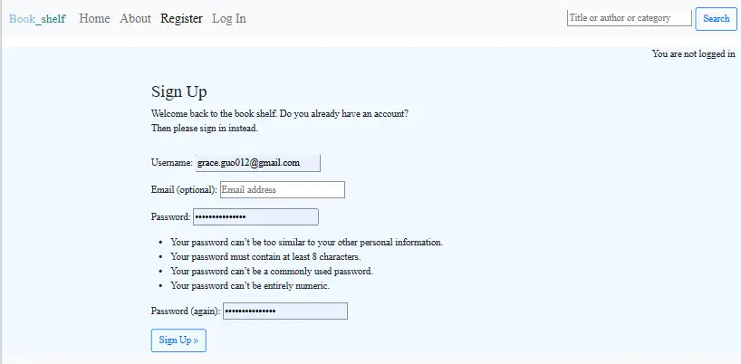
 - 
 - 

### Book create/edit/delete
| TestCase Title | Preconditions | Pass/Fail |
|----------|----------|----------|
| At add a book page, create a new book record by filling in the book form| Logged-in user, click 'create' below the book form| Pass|
| Notification message to inform if adding a book successfully| Logged-in user, click 'create' below the book form| Pass |
| At edit a book page, the book form pre-filled with specific book information| Logged-in user who created the book record, click 'update' button below the book title in home page| Pass |
| At edit a book page, edit a book record by editting the book form| Logged-in user who created the book record, click 'update' below the book form| Pass |
| Notification message to inform if editing a book successfully | Logged-in user who created the book record, click 'update' below the book form| Pass |
| At delete a book page, confrimation question presented | Logged-in user who created the book record, click 'delete' button below the book title in home page | Pass |
| At delete a book page, delete a book record after confirmation | Logged-in user who created the book record, click ' Confirm delete' below the confirm question | Pass |
| Notification message to inform if deleting a book successfully| Logged-in user who created the book record, click ' Confirm delete' below the confirm question | Pass |
| At delete a book page, revert back to home page if decide not to delete| Logged-in user who created the book record, click ' Take me home' below the confirm question| Pass |

  - 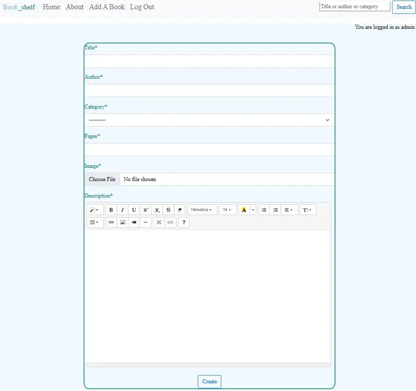
  - 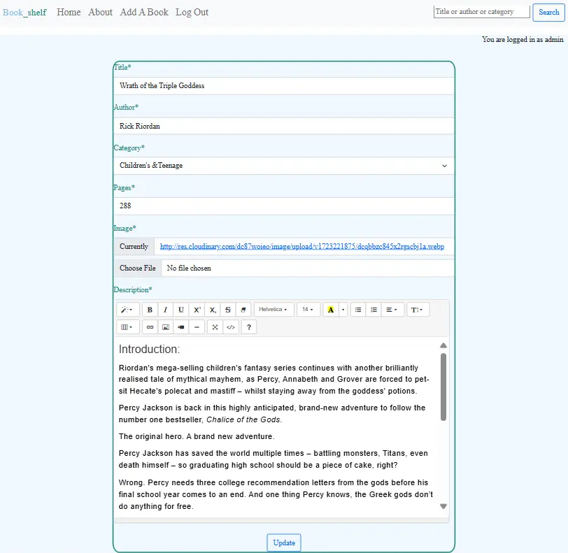
  - 
  - 

### Review create/read/edit/delete
| TestCase Title | Preconditions | Pass/Fail |
|----------|----------|----------|
| At the book detail page, view the comment to the book | Logged-in user | Pass |
| At the book detail page, view the comment count to the book | Logged-in user | Pass |
| At the book detail page, not able to view the comment to the book | Guest | Pass |
| At the book detail page, add the comment to the book | Logged-in user | Pass |
| Notification message to inform if adding a review successfully| Logged-in user, click 'Submit' below the review form| Pass |
| At the book detail page, edit the comment to the book| Logged-in user who created the comment to the book, click the edit below the comment | Pass |
| At the book detail page, edit the comment to the book, review form pre-filled with the specific information| Logged-in user who created the comment to the book, click the edit below the comment | Pass |
| Notification message to inform if editting a review successfully| Logged-in user, click 'Update' below the review form| Pass |
| At the book detail page, delete the comment to the book | Logged-in user who created the comment to the book, click the delete below the comment| Pass |
| At the book detail page, confirmation question modal to confirm to delete the comment to the book  | Logged-in user who created the comment to the book, click the delete below the comment| Pass |
| Notification message to inform if delete a review successfully| Logged-in user, click 'Delete' for the confirmation question | Pass |

  - 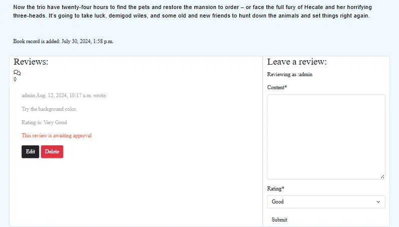
  - 
  - 

### Security
| TestCase Title | Preconditions | Pass/Fail |
|----------|----------|----------|
| Not able to add a book | Guest is not shown the 'add a user' in navbar | Pass |
| Not able to add a book after logging out| Copy the 'add a book' url after logging out, it turns to signin page to re-sign in for access  | Pass |
| Not able to edit a book| Guest or the user who is not the book record creator has no visibility of update button | Pass |
| Not able to edit a book  after logging out | Copy the 'edit a book' url after logging out, it turns to signin page to re-sign in for access  | Pass |
| Not able to delete a book| Guest or the user who is not the book record creator has no visibility of delete button | Pass |
| Not able to delete a book  after logging out| Copy the 'delete a book' url after logging out, it turns to signin page to re-sign in for access | Pass |
| Not able to add a review | Guest is not shown the 'comment' in book detail page | Pass |
| Not able to add a review after logging out| Copy the 'create a review' url after logging out, it turns to signin page to re-sign in for access  | Pass |
| Not able to edit a review| Guest or the user who is not the review record creator has no visibility of update button below the comment| Pass |
| Not able to edit a review  after logging out | Copy the 'edit a review' url after logging out, it turns to signin page to re-sign in for access  | Pass |
| Not able to delete a review| Guest or the user who is not the review record creator has no visibility of delete button below the comment | Pass |
| Not able to delete a review  after logging out| Copy the 'delete a review' url after logging out, it turns to signin page to re-sign in for access | Pass |

  - 
  - 

### Search a book
| TestCase Title | Preconditions | Pass/Fail |
|----------|----------|----------|
| Search a book by book title keywords show results or not found| Input book title key words and click 'search' | Pass |
| Search a book by book author keywords show results or not found| Input book author key words and click 'search' |  Pass |
| Search a book by book title keywords show results or not found| Input book title key words capital or small leter or mixed, and click 'search' | Pass |
| Search a book by book author keywords show results or not found| Input book author key words capital or small leter or mixed, and click 'search'  |Pass |
| Search a book by book catogery show results or not found| Input book category 'Fiction' 'Non_fiction' 'Science_fiction' or 'Children's&Teenage, and click 'search' | Pass |

  - 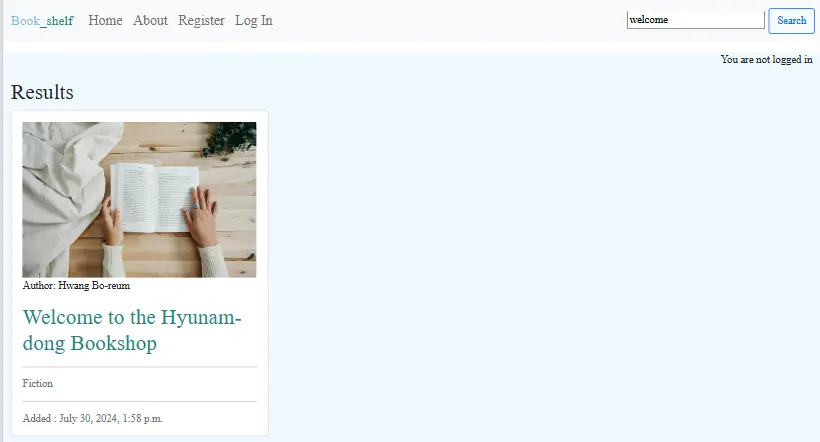
  - 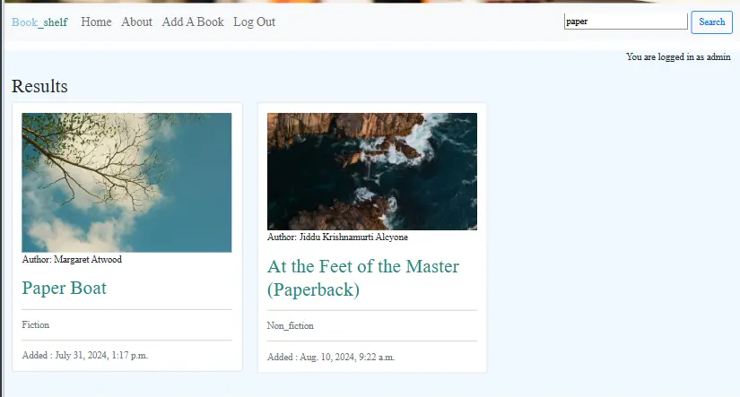
  - 

### Responsiveness
| TestCase Title | Preconditions | Pass/Fail |
|----------|----------|----------|
| Homepage responsiveness| At home page, change to mobile screen size or laptop screensize | Pass |
| Aboutpage responsiveness| At about page change to mobile screen size or laptop screensize | Pass |
| Signin page responsiveness| At signin page change to mobile screen size or laptop screensize | Pass |
| Register page responsiveness| At register page change to mobile screen size or laptop screensize | Pass |
| Logout page responsiveness| At logout page change to mobile screen size or laptop screensize | Pass |
| Add/edit a book page responsiveness| At add/edit a book page change to mobile screen size or laptop screensize | Pass(Partially pass, the third party package of summernotewidget' width is not responsive which is out of control)
| Add/edit/delete review page responsiveness| At add/edit/delete a review page change to mobile screen size or laptop screensize | Pass |

### Lighthouse report

- There are some improvements to implement based on Lighthouse report related to performance, accessibility, best practices, and SEO. For example: properly size images, avoid large layout shifts.

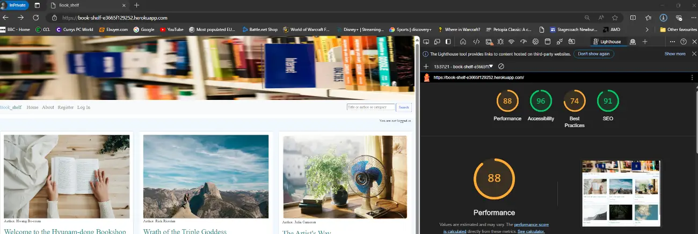

## Bugs fixed and to fix

### Fixed bug: 
- Uploading an image into CloudinaryField when add a new book, the uploaded image information is not shown in admin panel, just placeholder image instead.It 
  is fixed by amending create_book function in view.py file by changing statement to : form = BookForm(request.POST,request.FILES) rather than form = BookForm(request.POST).
 
 
 

### Warnings: 
- Warnings on console when loading the cloudinary images url as below, it also impacts the lighthouse report' Best Practices score.

 

[Back to Top](#top)

# technologies-used
The technologies implemented in this application included HTML5, CSS, Bootstrap, Javascript , Python , PostgreSQL , Heroku and Django.

- Python used as the back-end programming language.

- Git used for version control.

- GitHub used for secure online code storage.

- Gitpod used as a cloud-based IDE for development.

- Bootstrap used as the front-end CSS framework for modern responsiveness and pre-built components.

- PostgreSQL used as the ratioanl database.

- Lucidchart - for database ER diagrams.

- Heroku used for hosting the deployed full stack site.

- Cloudinary used for online static file storage.

- Balsamiq utilized for design and prototyping(wireframes).

- Google,Stack Overflow and ChatGPT utilized for general research or solving a bug, information gathering, and various online tools.

[Back to Top](#top)

# Deployment

## Deployment Guide
### Deployment Steps:
- Creating the Heroku App account and log in
- Enable two-factor Authentication select via authenticator app(Install 'authenticator' application) approach. 
- In the Heroku Dashboard, click on 'New' and then select 'Create New App'
- Create a unique name for your project and select the closest region in this case is EURO Region and click on "Create App".
- In the "Deploy" tab, choose GitHub as the deployment method.
- Connect your GitHub account and find/connect your GitHub repository.

### Setting Up Environment Variables
- Add Heroku to the ALLOWED_HOSTS list and CSRF_TRUSTED_ORIGINS list.
- Configure static files and templates directories in settings.py.
- Run 'python3 manage.py collectstatic' command in terminal
- Create env.py in the top level of the Django app and import os in env.py.
- Set up necessary environment variables in env.py, including the secret key, database URL and cloudinary URL.
- Update settings.py to use environment variables for secret key, database URL, cloudinary URL and DEBUG value.
- Configure environment variables in the Heroku "Settings" tab under "Config Vars".

### Creating Procfile
- Create a Procfile in the top level directory.
- Add the command to run the project in the Procfile.

### Heroku Deployment
- In Heroku, navigate to the Deployment tab and deploy the branch manually.
- Monitor the build logs details for any error or click the 'View log' at the top of application page.
- Upon successful deployment, Heroku will display a link to the live site at the bottom or click 'Open App' at the top of application page.
- Make sure to resolve any deployment errors by adjusting the code and system variables' settings if necessary.

### Forking the Repository
Forking the GitHub Repository allows you to create a copy of the original repository without affecting it. Steps are as below:

- Log in to GitHub or create an account.
- Visit the repository link.
- Click on "Fork" at the top of the repository.

### Creating a Clone of the Repository
Creating a clone enables you to make a local copy of the repository. Steps are as below:

- Navigate to the book_shelf repository.
- Click on the <>Code button.
- Select the "HTTPS" option under the "Local" tab and copy the URL.
- Open your terminal and change the directory to your desired location.
- Use git clone followed by the copied repository URL.

[Back to Top](#top)

# Credits
## Images 
- Background image and book featured images for the mock content were taken from free stock photos on [Pexels](https://www.pexels.com/)
- Image format conversion implemented via [freeconvernt](https://www.freeconvert.com/png-to-webp)
 

## Code
- Code Institute course content for providing the knowledge and guidance to build the project.
- Course Facilitator Alexander Tastad and David Calikes continued support and guidance.
- Tutor Kevin Loughrey, Spence, Martin' subject matter sessions and coding sessions.
- GitHub user katiejanecoughlan and Gordon-Meade for sharing README structure.
- Fellow cohort peers support and knowledge sharing during the course learning journey.

[Back to Top](#top)