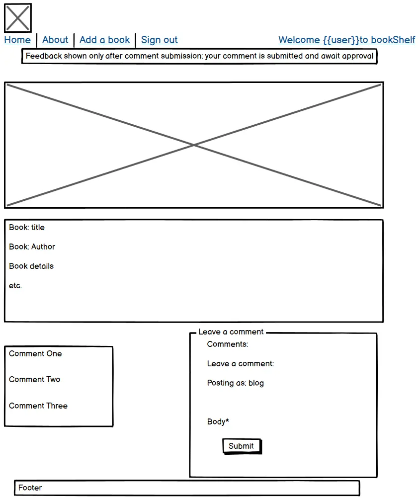

# The book shelf

## Purpose/Target Audience

 The book_shelf website is primary to provide an online book sharing and recommendation community for those who enjoy sharing their reading experiences and recommendations with others.  It provides easy access to summaries, reviews, and ratings, helping users discover new books. Basedd on the user's reading history, preferences, and interests, they can connect with like-minded readers.

[Link to the live site](https://book-shelf-e3665f129252.herokuapp.com/)

## Index – Table of Contents
* [User Experience (UX)](#user-experience-ux) 
* [Agile](#agile)
* [Features](#features)
* [Technologies Used](#technologies-used)
* [Testing](#testing)
* [Deployment](#deployment)
* [Credits](#credits)

## Database plan
## Data structure in Lucichart

- After project purpose decided, lucichart used to implement to plan the database structure.
- The above diagram is serving as an initial guide to indicate the types and relationships between data stored.

## Data models

- User model
 - -  Django pre-defined class-based model. Username and password implemented to login.
- Book model
 - - | title | CharField | | pages | integerField | | author | CharField | | description | TextField | | created_on | DateTimeField | | approval | BooleanField | | category | ForeignKey | | Updated_on | DateTimeField | | image | CloudinaryField || user | ForeignKey |
- Review model
 - - | book | ForeignKey | | user | ForeignKey | | content | TextField | | created_on | DateTimeField | | approval | BooleanField |
- Category model
 - -  | book | ForeignKey | | name | CharField |

[Back to Top](#top)

## Overview

The UX design focuses on creating an engaging and welcoming environment. After signup and logging in, the site user would be able to add a new book they would like to share with other users and add a review to any other books. They can search book by book name, book author or book category.

## Site User
The primary users of book_shelf are anyone who would like to share or recommend books based on their reading experiences and preferences. It aims to provide a supportive and inclusive community where the site users can share their feelings about books and recommend books to other like-minded readers. They value authenticity, empathy, and the opportunity to engage with like-minded individuals in a safe and welcoming space.

## Purposes for the site
To provide inspirations for someone who is seeking new books to read and build meaningful connections with other readers. The site commits for an environment where users feel encouraged to share or recommend their books.

## Wireframes created in Balsamic
- Home Page for mobile screen
  - 

- Home Page for pad/laptop screen
  - 

- About Page
  - 

- Book detail page for logged in user
  - 

- Add a book page for logged in user
  - 

### Colour schemes
The colour schemes generated from [cooler](https://coolors.co/c9daea-03f7eb-00b295-191516-ab2346) as below:

[Back to Top](#top)

# agile

## Design 
### Colour schemes:
### Typography:
### Features

## Future features:
- Data Models
- User FLow Chart

## Validation
- HTML
- CSS
- Python

## Responsiveness

## Testing

## Tools and Technologies Used:
The technologies implemented in this application included HTML5, CSS, Bootstrap, Python, Javascript and Django.

- Python used as the back-end programming language.

- Git used for version control.

- GitHub used for secure online code storage.

- Gitpod used as a cloud-based IDE for development.

- Bootstrap used as the front-end CSS framework for modern responsiveness and pre-built components.

- PostgreSQL used as the ratioanl database.

- Heroku used for hosting the deployed full stack site.

- Cloudinary used for online static file storage.

- Balsamiq utilized for design and prototyping(wireframes).

- Use cooler https://coolors.co/c9daea-03f7eb-00b295-191516-ab2346 for colour scheme.

- Google,Stack Overflow and ChatGPT utilized for general research or solving a bug, information gathering, and various online tools.

## Languages Used:
- HTML5
- CSS
- JavaScript
- Python

## Deployment :

## Testing & Bugs

## Credit: