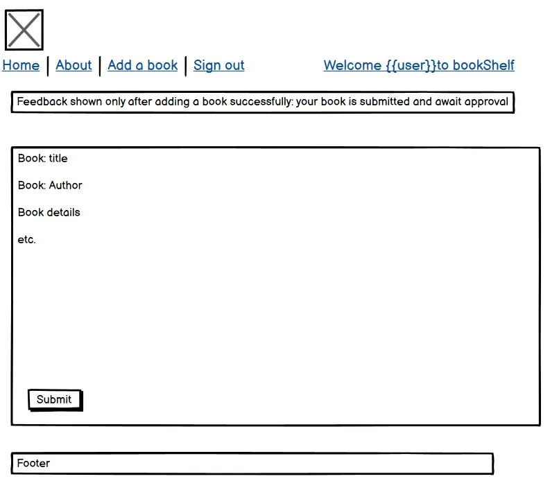
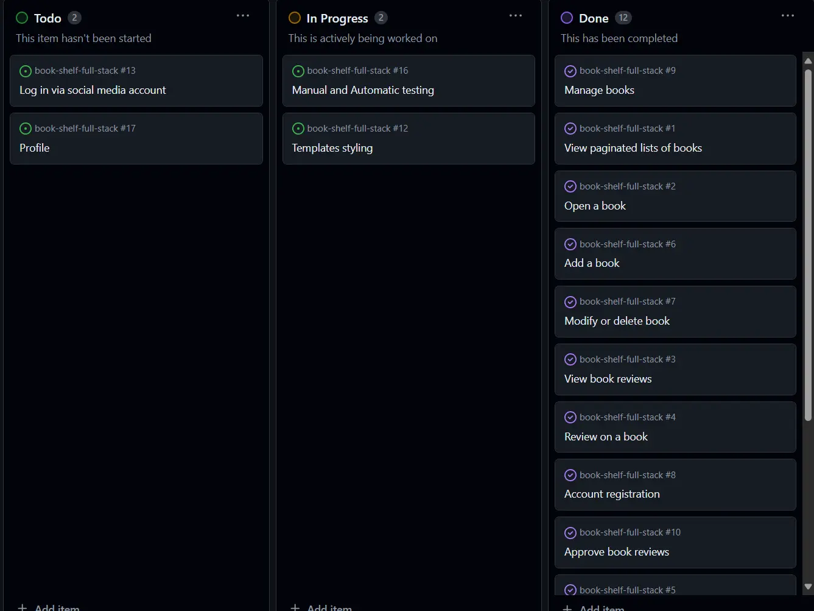

# The book shelf

## Purpose/Target Audience

 The book_shelf website is primary to provide an online book sharing and recommendation community for those who enjoy sharing their reading experiences and recommendations with others.  It provides easy access to summaries, reviews, and ratings, helping users discover new books. Basedd on the user's reading history, preferences, and interests, they can connect with like-minded readers.

[Link to the live site](https://book-shelf-e3665f129252.herokuapp.com/)

## Index – Table of Contents
* [User Experience (UX)](#user-experience-ux) 
* [Agile](#agile)
* [Features](#features)
* [Technologies Used](#technologies-used)
* [Testing](#testing)
* [Deployment](#deployment)
* [Credits](#credits)

## Database plan
## Data structure in Lucichart

- After project purpose decided, lucichart used to implement to plan the database structure.
- The above diagram is serving as an initial guide to indicate the types and relationships between data stored.

## Data models

- User model
 - -  Django pre-defined class-based model. Username and password implemented to login.
- Book model
 - - | title | CharField | | pages | integerField | | author | CharField | | description | TextField | | created_on | DateTimeField | | approval | BooleanField | | category | ForeignKey | | Updated_on | DateTimeField | | image | CloudinaryField || user | ForeignKey |
- Review model
 - - | book | ForeignKey | | user | ForeignKey | | content | TextField | | created_on | DateTimeField | | approval | BooleanField |
- Category model
 - -  | book | ForeignKey | | name | CharField |

[Back to Top](#top)

# user-experience-ux

## Overview

The UX design focuses on creating an engaging and welcoming environment. After signup and logging in, the site user would be able to add a new book they would like to share with other users and add a review to any other books. They can search book by book name, book author or book category.

## Site User
The primary users of book_shelf are anyone who would like to share or recommend books based on their reading experiences and preferences. It aims to provide a supportive and inclusive community where the site users can share their feelings about books and recommend books to other like-minded readers. They value authenticity, empathy, and the opportunity to engage with like-minded individuals in a safe and welcoming space.

## Purposes for the site
To provide inspirations for someone who is seeking new books to read and build meaningful connections with other readers. The site commits for an environment where users feel encouraged to share or recommend their books.

## Wireframes created in Balsamic
- Home Page for mobile screen
  - 

- Home Page for pad/laptop screen
  - 

- About Page
  - 

- Book detail page for logged in user
  - 

- Add a book page for logged in user
  - 

### Colour schemes
The colour schemes generated from [cooler](https://coolors.co/c9daea-03f7eb-00b295-191516-ab2346) as below:

[Back to Top](#top)

# agile

## Agile development

For the development of book_shelf, Agile methodology used to ensure iterative and efficient progress throughout the project lifecycle. Central to this approach was the utilization of a Kanban board hosted on GitHub Projects. You can view the project board as: [KANBAN Board](https://github.com/users/Grace-YuGuo/projects/6).

 -

### Kanban overview
The Kanban board served as a visual representation of the project's progress and allowed for effective task management. It consisted of the following sections:

- Todo: This section contained all the tasks and user stories that were yet to be prioritized for implementation.
- In Progress: Work in progress was tracked here, indicating tasks actively being worked on.
- Done: Tasks that were completed successfully were moved to this column.

### User Stories Integration
User stories played a pivotal role in shaping the development process, ensuring that features were aligned with user needs. These user stories were mapped onto the Kanban board, guiding the prioritization and implementation of tasks.

### Task Management
In addition to tracking user stories, the Kanban board served as a comprehensive task list. I utilized it to break down user stories into smaller, actionable tasks, ensuring clear and manageable objectives for development. This granular approach facilitated efficient progress tracking and enhanced team collaboration.

By leveraging Agile principles and utilizing the Kanban board effectively, the development of book_shelf remained focused, adaptable, and responsive to evolving requirements, resulting in a more robust and user-centric Django blog application.

## User Stories Overview
### List of User Stories

- [#1 View paginated lists of books ](https://github.com/Grace-YuGuo/book-shelf-full-stack/issues/1)
- [#2 Open a book ](https://github.com/Grace-YuGuo/book-shelf-full-stack/issues/2)
- [#3 View book reviews ](https://github.com/Grace-YuGuo/book-shelf-full-stack/issues/3)
- [#4 Review on a book ](https://github.com/Grace-YuGuo/book-shelf-full-stack/issues/4)
- [#5 Modify or delete a review on a book ](https://github.com/Grace-YuGuo/book-shelf-full-stack/issues/5)
- [#6 Add a book ](https://github.com/Grace-YuGuo/book-shelf-full-stack/issues/6)
- [#7 Modify or delete book ](https://github.com/Grace-YuGuo/book-shelf-full-stack/issues/7)
- [#8 Account registration](https://github.com/Grace-YuGuo/book-shelf-full-stack/issues/8)
- [#9 Manage books ](https://github.com/Grace-YuGuo/book-shelf-full-stack/issues/9)
- [#10 Approve book reviews](https://github.com/Grace-YuGuo/book-shelf-full-stack/issues/10)
- [#11 About ](https://github.com/Grace-YuGuo/book-shelf-full-stack/issues/11)
- [#12 Templates styling ](https://github.com/Grace-YuGuo/book-shelf-full-stack/issues/12)
- [#13 Log in via social media accounts ](https://github.com/Grace-YuGuo/book-shelf-full-stack/issues/13)
- [#14 Search the book by title author and category ](https://github.com/Grace-YuGuo/book-shelf-full-stack/issues/14)
- [#15 Manual and automatic testing ](https://github.com/Grace-YuGuo/book-shelf-full-stack/issues/16)
- [#16 Profile ](https://github.com/Grace-YuGuo/book-shelf-full-stack/issues/17)

### MOSCOW Details
- MO (Book CRUD | Review CRUD | Account registration | )
- S ( Approve book reviews | Approve book | About page | Search book)
- CO (View paginated books | Templates styling | )
- W (Log in via social media account | Profile page)

[Back to Top](#top)

# Features

## Features implemented

- Full CRUD on review of a book: the logged-in site user can create, read, edit and delete their review on a book
- Full CRUD on a book: the logged-in site user can create,read,edit and delete their book
- Search a book via key words in book title or book author or 4 categories(Fiction,Non_fiction,Science_fiction and Children's&Teenage books)
- The site admin maintain the submitted books and reviews of specific books.

- 
- 
- 
- 

### Navbar and Footer:
- Unified Navbar and footer on every page
- Navbar's changes as signing in status,logged in user can see add a book tab
- Footer includes Social Links and github links

### Index page:
- The homepage provides the list of books
- It can be accessed without signing in

### About Us page:
- About page includes a short brief about the book_shelf site
- It can be accessed without signing in

### Responsiveness
- There's a hamburger navbar on mobile size screen

## Future features
- Log in via social account
- Profile page

[Back to Top](#top)

# Testing 

## Validation
### HTML
[W3 HTML Validator](https://validator.w3.org/) to check the HTML
screenshot

### CSS
[W3 CSS Validator](https://jigsaw.w3.org/css-validator/) to check the CSS
screenshot

### Python
[CI Python Linter](https://pep8ci.herokuapp.com/) to check python scripts
screenshot

## Manual test
### Home page
Test Result

### About page
Test Result

### Footer/NAVBar
Test Result

### Login/logout/registration page
Test Result

### Review CRUD
Test Result

### Book CRUD
Test Result

### Search a book
Test Result

[Back to Top](#top)

# technologies-used
The technologies implemented in this application included HTML5, CSS, Bootstrap, Python, Javascript and Django.

- Python used as the back-end programming language.

- Git used for version control.

- GitHub used for secure online code storage.

- Gitpod used as a cloud-based IDE for development.

- Bootstrap used as the front-end CSS framework for modern responsiveness and pre-built components.

- PostgreSQL used as the ratioanl database.

- Lucidchart - for database ER diagrams

- Heroku used for hosting the deployed full stack site.

- Cloudinary used for online static file storage.

- Balsamiq utilized for design and prototyping(wireframes).

- Google,Stack Overflow and ChatGPT utilized for general research or solving a bug, information gathering, and various online tools.

[Back to Top](#top)

# Deployment

## Deployment Guide
### Deployment Steps:
- Creating the Heroku App
- Begin by signing up or logging in to Heroku.
- In the Heroku Dashboard, click on 'New' and then select 'Create New App'.
- Choose a unique name for your project.
- Select the closest region in this case is EURO Region
- Click on "Create App".
- In the "Deploy" tab, choose GitHub as the deployment method.
- Connect your GitHub account and find/connect your GitHub repository.

### Setting Up Environment Variables
- Create env.py in the top level of the Django app.
- Import os in env.py.
- Set up necessary environment variables in env.py, including the secret key and database URL.
- Update settings.py to use environment variables for secret key and database.
- Configure environment variables in the Heroku "Settings" tab under "Config Vars".
- Migrate the models to the new database connection in the terminal.
- Configure static files and templates directories in settings.py.
- Add Heroku to the ALLOWED_HOSTS list.

### Creating Procfile and Pushing Changes
- Create a Procfile in the top level directory.
- Add the command to run the project in the Procfile.
- Add, commit, and push the changes to GitHub.

### Heroku Deployment
- In Heroku, navigate to the Deployment tab and deploy the branch manually.
- Monitor the build logs for any errors.
- Upon successful deployment, Heroku will display a link to the live site.
- Make sure to resolve any deployment errors by adjusting the code as necessary.

### Forking the Repository
Forking the GitHub Repository allows you to create a copy of the original repository without affecting it. Follow these steps:

- Log in to GitHub or create an account.
- Visit the repository link.
- Click on "Fork" at the top of the repository.

### Creating a Clone of the Repository
Creating a clone enables you to make a local copy of the repository. Follow these steps:

- Navigate to the Sojourn Scribbles repository.
- Click on the <>Code button.
- Select the "HTTPS" option under the "Local" tab and copy the URL.
- Open your terminal and change the directory to your desired location.
- Use git clone followed by the copied repository URL.

[Back to Top](#top)

# Credits
## Images 
-Background image and book featured images for the mock content were taken from free stock photos on Pexels

## Code
- Code Institute course content for providing the knowledge and guidance to build the project
- GitHub user katiejanecoughlan for sharing a best practice README structure
- Course Facilitator Alex/David
- Tutor Kevin /Martin/ Spencers
- Fellow cohort peers

[Back to Top](#top)